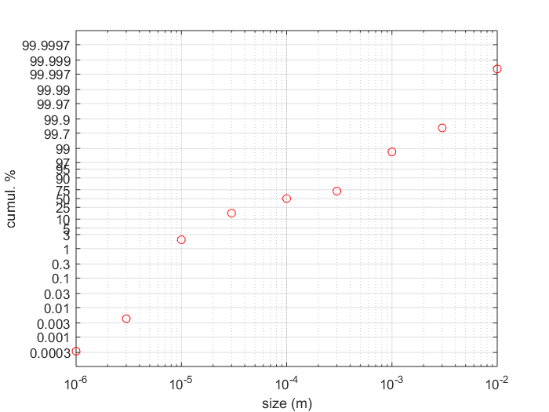

# symmetric_loglike_plot
Log-like plotting function, symmetric about 50%. For data where values of interest are close to 0 and 100% (e.g., particle size distribution data).

## Mapping function
where y is input y-axis data (in percent), define: \
  b = 50 / (ln(50)-ln(y_min))\
  a = -b*ln(y_min)

Map the position of the y data to position Y:\
  if 0<y<=50, then Y = b*ln(y)+a\
  if 50<y<100, then Y = 100 - b*ln(100-y)-a

## Example output

